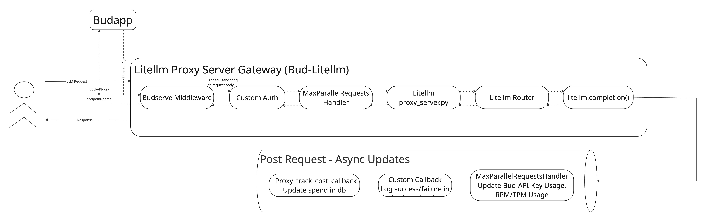

---

## **Litellm Integration in Bud Application**

### 1. **Overview**
Litellm is integrated into the Bud application as a proxy server for inference requests. It enables routing strategies, high availability, and fault tolerance for user-deployed models. This setup helps abstract the complexity of dealing directly with provider-specific APIs while giving users control over performance, cost, and reliability.

---

### 2. **Supported Providers**
Litellm in Bud supports multiple cloud-based LLM providers, including:
- **OpenAI**
- **Anthropic**
- **Google Vertex AI**
- *(extendable to others as needed)*

---

### 3. **Configuration**
The Bud-proxy microservice includes a configuration file for Litellm. Here’s a sample config:

```yaml
general_settings:
  store_model_in_db: True
  custom_auth: litellm.custom_auth.user_api_key_auth
  master_key: "os.environ/LITELLM_MASTER_KEY"

router_settings:
  cache_responses: False
  redis_host: "os.environ/REDIS_HOST"
  redis_port: "os.environ/REDIS_PORT"
  redis_password: "os.environ/REDIS_PASSWORD"

litellm_settings:
  callbacks: litellm.custom_callbacks.proxy_handler_instance
  drop_params: true
```

---

### 4. **Bud Architecture Integration**
Litellm runs as part of the `bud-proxy` microservice and handles all incoming inference requests. It routes these requests to appropriate model backends using configurations and strategies defined by the user.



---

### 5. **Custom Auth & Middleware**
Bud uses a **forked version** of Litellm (`bud-litellm`) that includes:
- **Custom Auth Handler**: Validates API keys generated by Bud for expiration and usage budget.
- **Custom Callback Handler**: Logs request/response metrics in `budmetrics` database.
- **Budserve Middleware**: Resolves API key and model to `user_config`, which Litellm uses for routing.

---

### 6. **Error Handling & Retries**
Litellm supports:
- Automatic retries
- Fallback models
These features improve request success rate and reliability under failure conditions.

---

### 7. **Authentication & Validation**
Using custom auth plugin, Litellm checks:
- Validity of API key
- Budget/usage limits
This is extensible — teams can build on this logic for stricter controls.

---

### 8. **Rate Limiting & Caching**
Rate limiting and caching are both natively supported in Litellm. Bud has extended support to include **Redis-based GPTCache**, in addition to:
- In-memory caching
- Redis cache
- Semantic caches (Qdrant, Redis, S3)

---

### 9. **Development & Usage**
Bud uses a **forked version** of Litellm (`bud-litellm`) internally. Developers do not interact with Litellm directly, but through this forked repo integrated into `bud-proxy`.

---
