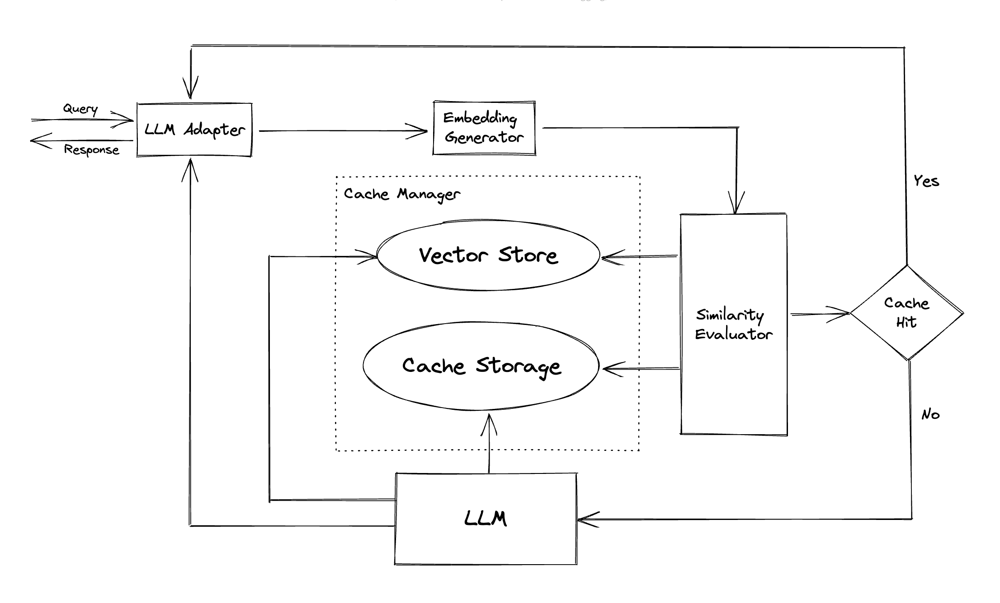

## **Adding GPTCache Support to Litellm**

### **1. Overview**

GPTCache is an open-source semantic cache designed to enhance the efficiency and speed of GPT-based applications by storing and retrieving the results of previous queries. By caching responses to similar or identical prompts, GPTCache reduces the number of redundant requests to Large Language Models (LLMs), thereby decreasing latency and operational costs.

Key benefits of integrating GPTCache include:

- **Reduced Expenses**: By minimizing the number of requests and tokens sent to LLM services, GPTCache effectively lowers the costs associated with LLM usage.

- **Enhanced Performance**: Caching allows for faster response times, as results can be fetched directly from the cache without interacting with the LLM service.

[Ref](https://github.com/zilliztech/GPTCache/blob/main/README.md)



GPTCache has below components:

-- **Embedding Generator**: This module is used to extract embeddings from requests for similarity search.
Any HuggingFaceEmbeddings compatible model can be given for genereating embeddings. If no model name is given, then default model used is "sentence-transformers/all-MiniLM-L6-v2" and if wrong model name is provided then default embeddings are calculated using Onnx() model "GPTCache/paraphrase-albert-onnx".

-- **Scalar Storage**: This is where the response from LLMs, such as ChatGPT, is stored. Cached responses are retrieved to assist in evaluating similarity and are returned to the requester if there is a good semantic match. We use redis for scalar storage.

-- **Vector Storage**: The Vector Store module helps find the K most similar requests from the input request's extracted embedding. We use redis for vector storage.

-- **Similarity Evaluator**: This module collects data from both the Cache Storage and Vector Store, and uses various strategies to determine the similarity between the input request and the requests from the Vector Store. Based on this similarity, it determines whether a request matches the cache. We use SBERT crossencoders to evaluate sentences pair similarity. This evaluator use the crossencoder model to evaluate the similarity of two sentences. Default is 'cross-encoder/quora-distilroberta-base'.

-- **Cache Manager**: This is responsible for controlling the operation of both the Scalar Storage and Vector Storage. It manages eviction policy of scalar and vector storage using LRU, LFU, FIFO, RR and TTL strategies which can be defined by the user.

---

### **2. Target Use Case**

GPTCache is particularly beneficial in scenarios where:

- **High Query Redundancy**: Applications that receive repetitive or similar queries can leverage GPTCache to serve responses from the cache, reducing the need for repeated LLM calls.

- **Cost-Sensitive Operations**: Organizations aiming to optimize their expenditure on LLM services can use GPTCache to lower the number of API calls and associated costs.

- **Performance-Critical Applications**: In applications where response time is critical, such as real-time chatbots or customer support systems, GPTCache can significantly reduce latency by serving cached responses.

---

### 3. **Integration Approach**

To integrate GPTCache as a new caching backend in the Bud application, we extended the `bud-litellm` fork with a custom cache handler:

- A new cache handler class, `RedisGPTCache`, was added under `bud-litellm/litellm/caching/redis_gpt_cache.py`.
- A new cache type constant `REDIS_GPT_CACHE = "gpt_cache_redis"` was introduced in `LiteLLMCacheType`.
- During runtime, if the `cache_response` flag is enabled and the cache type is set to `"gpt_cache_redis"`, an instance of `RedisGPTCache` is initialized and used for caching.
- Each request fetches endpoint-specific cache settings by resolving the model name and API key from the inference request. These settings define the embedding model, similarity threshold, and eviction policy for the cache logic.

This design ensures a plug-and-play approach to adding or switching cache backends while allowing per-endpoint configuration for maximum flexibility.

---

### 5. **Configuration Parameters**

The cache settings are dynamically constructed at runtime during the request routing process. These are driven by both deployment environment variables and user-specific configuration passed in `user_config`.

Below is a sample of the merged configuration used to initialize the cache handler:

```json
{
  "cache_responses": true,
  "redis_host": "<from app_settings>",
  "redis_port": "<from app_settings>",
  "redis_password": "<from secrets_settings>",
  "endpoint_cache_settings": {
    "cache": true,
    "type": "gpt_cache_redis",
    "cache_params": {
      "host": "<from app_settings>",
      "port": "<from app_settings>",
      "password": "<from secrets_settings>",
      "similarity_threshold": "<from user_config or fallback to app_settings>",
      "redis_semantic_cache_use_async": false,
      "redis_semantic_cache_embedding_model": "<from user_config or fallback>",
      "eviction_policy": {
        "policy": "<from user_config or fallback>",
        "max_size": "<from user_config or fallback>",
        "ttl": "<from user_config or fallback>"
      }
    }
  },
  "routing_strategy_args": {
    "routing_policy": "<from user_config>"
  },
  "model_list": "<from user_config>"
}
```

In the router logic (`bud-litellm/litellm/router.py`), the cache is initialized using this configuration:

```python
# Determine the cache type
cache_type = (
    "redis" if endpoint_cache_settings is None
    else endpoint_cache_settings.get("type", "redis")
)

# Initialize cache
if cache_responses:
    if litellm.cache is None and endpoint_cache_settings:
        enable_cache = endpoint_cache_settings.get("cache", False)
        if enable_cache:
            endpoint_cache_config = endpoint_cache_settings.get("cache_params", {})
            if endpoint_cache_config:
                litellm.cache = litellm.Cache(type=cache_type, **endpoint_cache_config)
    self.cache_responses = cache_responses
```

This ensures that the GPTCache instance is created only when caching is explicitly enabled and configured per endpoint.

---

### 8. **Limitations / Caveats**

- **Cold Start Latency**: The first request that initializes the cache handler may experience added latency due to embedding model loading.
- **Embedding Computation Overhead**: Every cache lookup involves computing embeddings for input prompts, introducing slight latency even for hits.
- **Shared Eviction Policy**: All cached data currently resides in a shared Redis instance. Redis handles eviction globally, not per endpoint, which can lead to unintended data eviction. A custom eviction strategy scoped by namespace (e.g., API key + model) would be more robust.

---

### 9. **Future Enhancements**

- **Namespace-based Eviction**: Implement a custom eviction policy that respects endpoint boundaries using key prefixes or Redis namespaces.
- **Reduce Embedding Latency**: Optimize embedding computation by exploring more lightweight or quantized models.
- **Monitoring and Metrics**: Add instrumentation to log cache hit/miss ratios, eviction events, and average latency per endpoint to fine-tune configurations.

---
